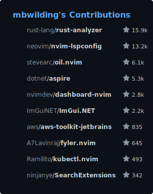
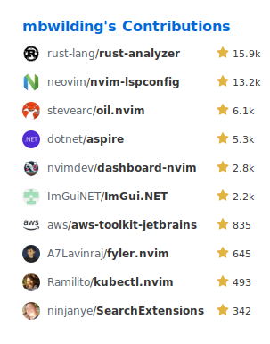

### About Me

- **.NET Developer** by day
- **Rust Enthusiast** by night
- Passionate about **cloud**, **DevOps**, and **open source**
- Always learning, always sharing

### Setup

- **Editor:** [Neovim](https://neovim.io)
- **OS:** [Arch Linux](https://archlinux.org) (btw 😉)
- **Keyboard:** [Dygma Defy](https://dygma.com/pages/defy)
- **Layout:** [Dvorak](https://en.wikipedia.org/wiki/Dvorak_keyboard_layout)

> Did I mention I use Arch, btw?

  

  

