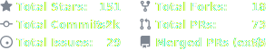
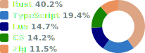
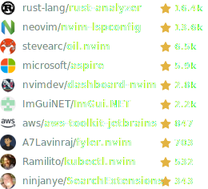

### About Me

.NET Engineer by day, Rust Enthusiast by night

Passionate about architecture, software, cloud, devops, and open source

### Setup

Editor: [Neovim](https://neovim.io)

OS: [Arch Linux](https://archlinux.org) btw 😉

Keyboard: [Dygma Defy](https://dygma.com/pages/defy)

Layout: [Dvorak](https://en.wikipedia.org/wiki/Dvorak_keyboard_layout)

### Statistics

<picture>
  <source media="(prefers-color-scheme: dark)" srcset="./assets/statistics_dark.svg" />
  <source media="(prefers-color-scheme: light)" srcset="./assets/statistics_light.svg" />
  
</picture>

### Languages

<picture>
  <source media="(prefers-color-scheme: dark)" srcset="./assets/languages_dark.svg" />
  <source media="(prefers-color-scheme: light)" srcset="./assets/languages_light.svg" />
  
</picture>

### Contributions

<picture>
  <source media="(prefers-color-scheme: dark)" srcset="./assets/contributions_dark.svg" />
  <source media="(prefers-color-scheme: light)" srcset="./assets/contributions_light.svg" />
  
</picture>
